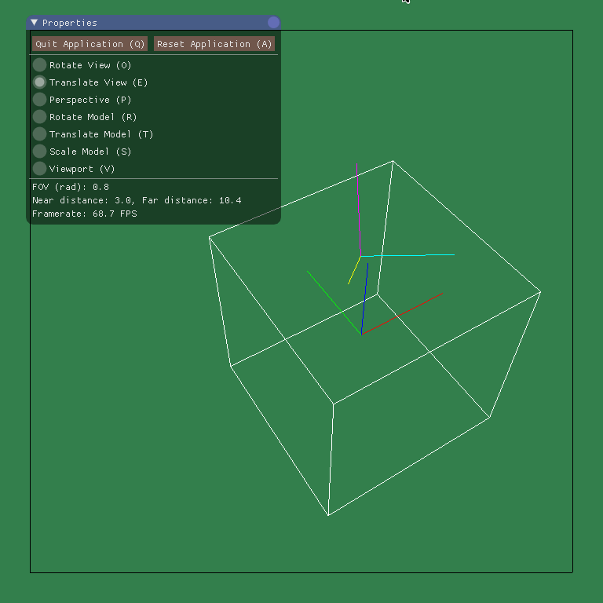

# Compilation
To compile and run, use the default premake/make commands in the A2 directory:

``` 
$ premake4 gmake
$ make
$ ./A2
```

Note that the code uses C++17 features (this is reflected in the A2 premake file). The graphics lab machines (`gl39`) seemed to support this.

# Manual
## Comments / Known Issues

## Assumptions
### Near/Far plane clipping
I perform near and far plane clipping before the perspective correction and homogenization.

The plane distances are clamped between 2 and 30.

### Viewing Frame
My camera's viewing frame is right handed, looking towards -z and with y upwards.

### Order Of Rotations
Rotations are applied around the X axis, then the Y axis, then the Z axis.

### Mouse Distance Mapping
The width of the window is mapped to ~180 degrees.

## Extra Commands/Features

## Additional data files

# Images

