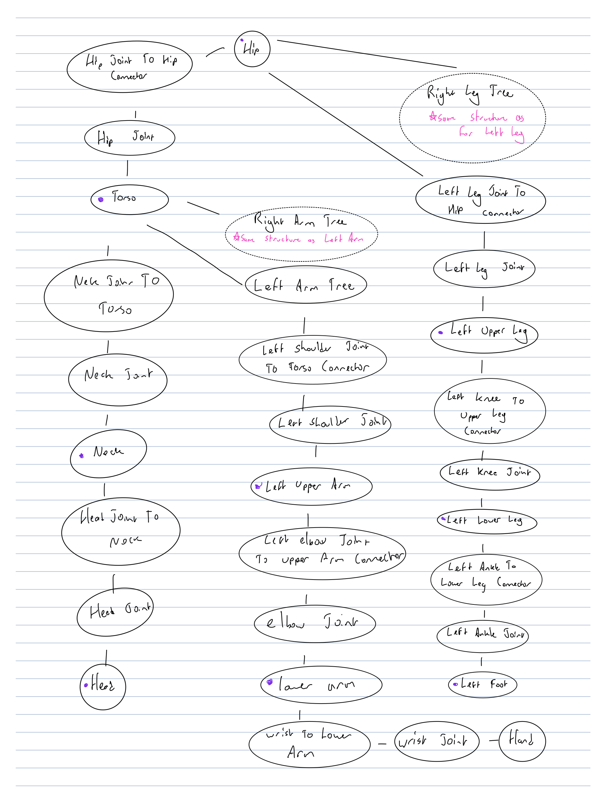

# Compilation
To compile and run, use the default premake/make commands in the A3 directory:

``` 
$ premake4 gmake
$ make
$ ./A3
```

Note that the code uses C++17 features (this is reflected in the premake file). The graphics lab machines (`gl39`) seemed to support this.

# Manual
## Undo/Redo Information
- There is a tracker for the current undo/redo state as well as the most recent action in the GUI so the user knows when they reach the top/bottom of the stack.

## Extra Commands/Features
- The option to view the picking shader buffer is given in the Options dropdown

## Additional data files
- There are a handful of new `.obj` files, specifically for a cone, triangle-base pyramid, triangular prism, and for a cube larger than the given one (the last one was so that I could more easily export transformations from blender given I had used the blender default cube). With a python script I had written (`./Assets/blenderExport.py`) I was able to export the main components of my model in the lua format. I then assembled all the components of the model as a whole by hand.

## Changes To Data Structures
- I tried *not* to change the given data structures as much as possible, and rather made some data structures to wrap around these. One exception was the `JointNode` class, to which I added some member variables to store current joint angles. Along with that, I added some helper functions to that class to update/get these angles, and also added a function to rotate around arbitrary axis for `SceneNode`.

- the core new data structure is the `Scene` class that manages a scene hierarchy, keeps track of important information such as the joint nodes and the head node, and also provides a handy preorder traversal iterator for the scene tree.

## Overview of Puppet Model
- The puppet is a model of Alphonse Elric from the show Fullmetal Alchemist

- The structure of the puppet follows the image below:



- In general, I broke down the model into individual components connected to singular joints. I would place the joints at the origin, and model the components next to them. After modeling these, I would connect joints with "connectors" to the hierarchical parent (eg. hand + wrist connected to lower arm). Geometry was attached to the "main" components that are initially attached to each joint (denoted in purple in the graph above).

- I decided to root the model at the hip, rather than the torso, so that the torso could be a child of the hip joint for a DOF at that joint

- In total there are 15 DOF: 3 in each of the the arms and legs, one at the hip, and two near the neck/head.

# Images

