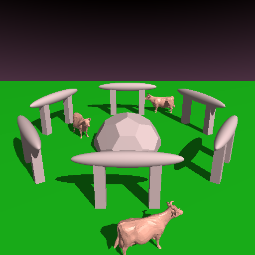
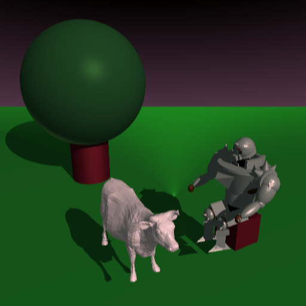

# Compilation
To compile, use the default premake/make commands in the A4 directory:

``` 
$ premake4 gmake
$ make
```

To run, `cd` to the assets directory and run:

``` 
$ ../A4 ./<file.lua>
```

Note that the code uses C++17 features (this is reflected in the premake file). The graphics lab machines (`gl39`) seemed to support this.

# Manual
## Sample Scenes
My `sample.lua` scene is located in the `Assets` directory. All of my sample renders (including `sample.png`) can be found in `Assets/SampleImages`.

## Extra Feature
My extra feature is antialiasing via jittered supersampling. Here are some comparison images of renderer with AA off and on:

### Non-AA scene


### Anti-aliased scene
The image uses a 3x3 pixel subdivision.


## Unique Scene
My unique scene `Assets/scene.lua` contains my puppet from A3, and the cow model. It pictures Alphonse transmuting a white cow sculpture (hence why its floating). The picture is included below as `screenshot.png`.

# Images

## Transmuted Cow Sculpture


