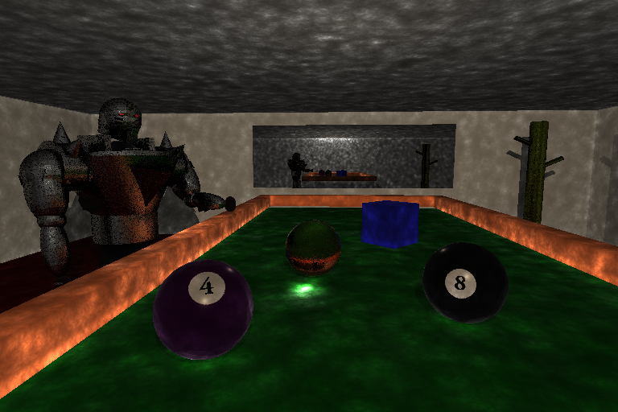

# Compilation
To compile, use the premake command in the A5 directory:

``` 
$ premake4 gmake
```

To compile the test suite, use:

``` 
$ make Tests
```

To compile the A5 executable, use:

``` 
$ make A5
```

To run, `cd` to the assets directory and run:

``` 
$ ../A5 ./<file.lua>
```

Note that the code uses C++17 features (this is reflected in the premake file). The graphics lab machines (`gl39`) seemed to support this.

# Manual
## Sample Scenes
Sample scenes can be found under `Assets/SampleScenes`. All of my sample renders can be found in `Assets/SampleImages`.

## Shortcomings
Due to time limitations, I was unable to implement soft shadows via area lights.

# Images


# Objectives
- [x] Cylinders and cone primitives are properly rendered.
- [x] Adaptive antialiasing is applied to the correct portions of the scene.
- [x] Objects are able to reflect light in the scene.
- [x] Objects are able to refract light in the scene.
- [ ] Soft shadows have been implemented.
- [x] Texture mapping has been implemented.
- [x] Normal mapping has been implemented.
- [x] Photons for photon mapping can be cast into the scene and collected for lighting calculations.
- [x] Photon maps can be used for caustic illumination calculations.

# Extra Objectives
- Multi threading is used to speed up the photon casting and ray tracing processes.
- The Cook-Torrance material model is supported.
- Glossy reflective and refractive surfaces are supported.
